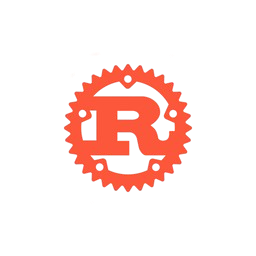

 ## Hi there 👋, I'm Betzalel75 
<!-- - 🔭 I’m currently working on Ray tracing
- 🌱 I’m currently learning Rust -->
<!--
**Betzalel75/Betzalel75** is a ✨ _special_ ✨ repository because its `README.md` (this file) appears on your GitHub profile.
Here are some ideas to get you started:
- 👯 I’m looking to collaborate on ...
- 🤔 I’m looking for help with ...
- 💬 Ask me about ...
- 📫 How to reach me: ...
- 😄 Pronouns: ...
- ⚡ Fun fact: ...
-->

### About Me 💬:    
🎓 **Full Stack Developer & Future Systems Engineer**

Holder of a **Bachelor's Degree in Computer Science and Industrial Electronics** (IPG-ISTI) and graduate of **Zone01 Dakar**, I specialize in building robust, high-performance, and secure applications — with a strong focus on low-level systems and infrastructure.

🧠 **Interests**:
- Embedded systems, systems programming, ELF binary parsing  
- Desktop app development with **Rust + Slint**  
- REST APIs and dynamic frontend with Angular  
- Reverse engineering, offensive cybersecurity  
- Linux system administration & DevOps  
- Internet of Things (IoT) & Electronics

🚀 **What drives me**:  
I'm passionate about understanding how computer systems work. I love analyzing how separate components interact and come together to form larger, functional systems.

📦 **Recent Projects**:
- System monitoring desktop app using **Rust + Slint**  
- Manual ELF file parsing from raw assembly  
- Custom Rust HTTP server with TOML-based configuration  
- Responsive UI development with Angular
- 🔧 **Docker Microservices Architecture** 
  - Deployed a full **microservices infrastructure** using Docker & Docker Compose:
    - 6 services: two PostgreSQL DBs, two apps (inventory/billing), a RabbitMQ queue, and an API gateway.
    - Designed with **Debian base images**, **custom Dockerfiles**, and **.env-based secrets** (no hardcoded credentials).
    - Used **Docker volumes** for persistent storage and **Docker networks** for internal service communication.
    - Architecture built, managed, and destroyed entirely with Docker Compose.

📫 **Reach out**:
- 

## Languages and Tools 

### Languages:
| Rust | C | JS | C++ | GO | Java |
|----------|----------|----------|-----|-----|-----|
|   |   |   |  |  |  | 

### My tools for Data Manipulation & Visualisation:

| MySQL | SQLite |
|-------|--------|
|| |

  
### Environments, Testing, Other:

| nodejs | Git | Docker | Vmware | VBox | Postman |
|--------|-----|--------|--------|------|---------|
|||||  |  |

### OS:

| Kali | Ubuntu | Windows |
|----------|----------|----------|
|  |  |  |

<!-- ### Tools for CTF's
 
| Metasploit | Wireshark | Burpsuite | Netcat | Nmap |
|----------|----------|----------|----------|----------|
|||||| -->

<!--

### It's not technology, but I use it. The section will be changed soon.:
  
  
  
  
  
  
  
  
    
  
  
  
--> 

---

  

  

---

  
  

 

  

 

